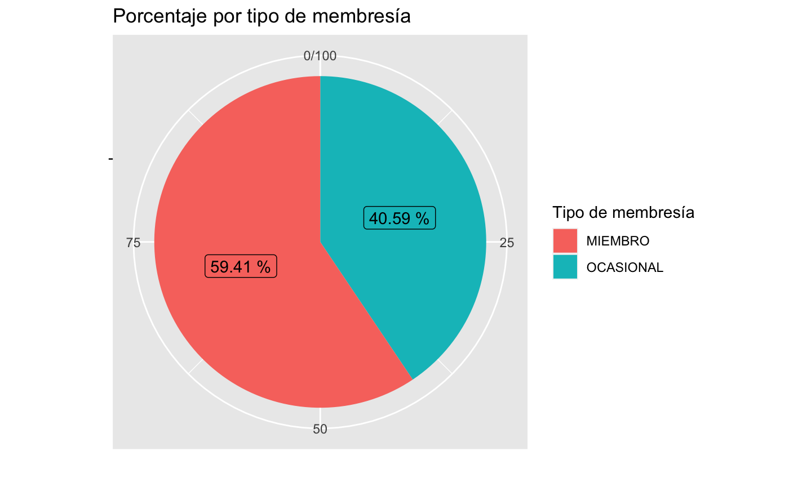
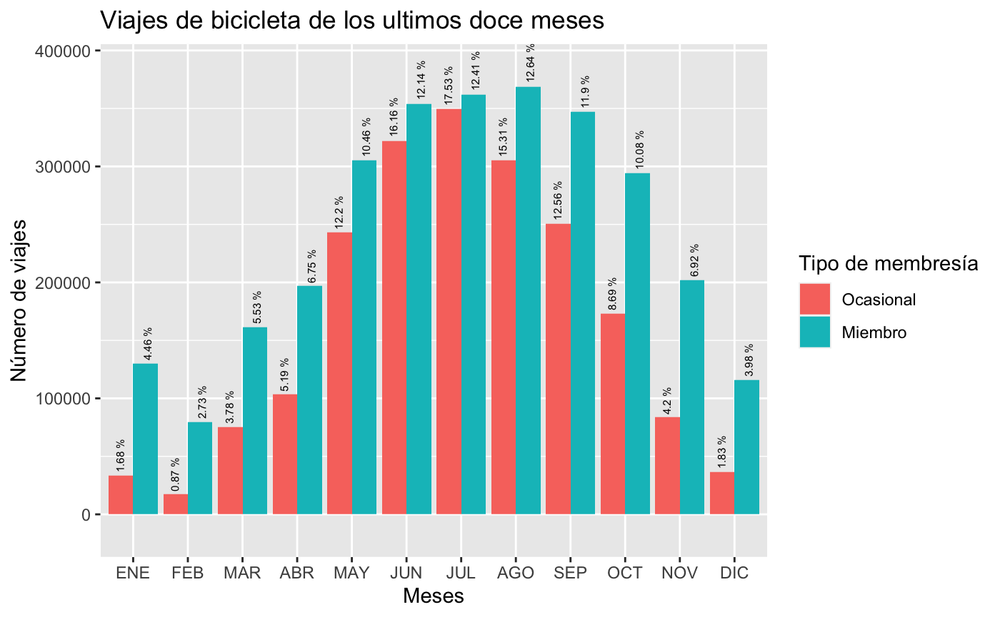
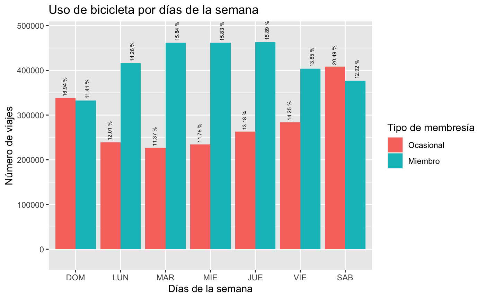
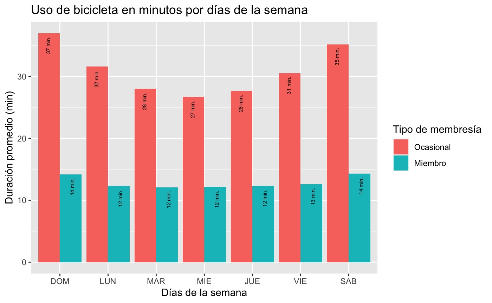
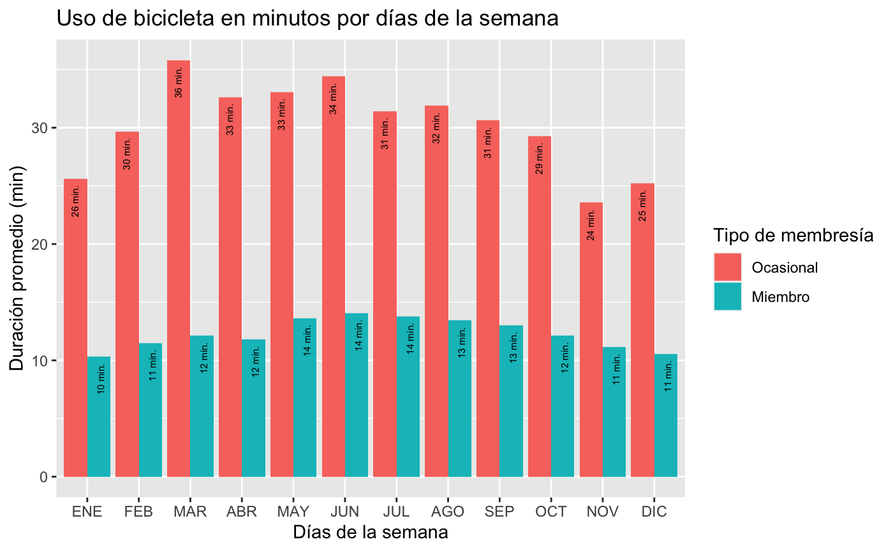
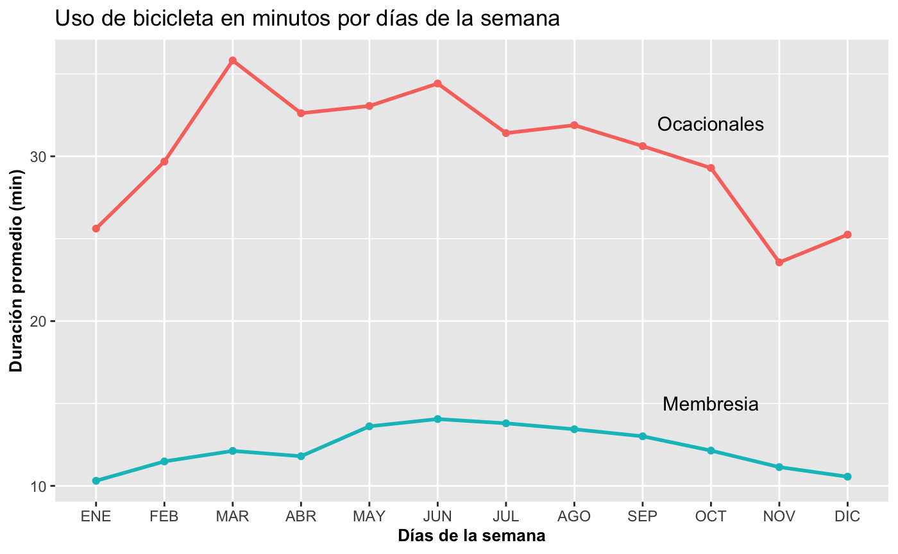
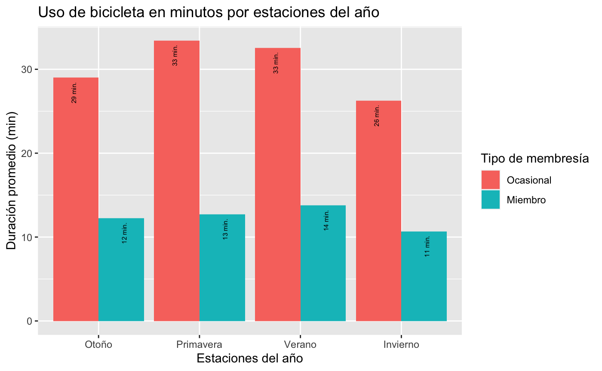
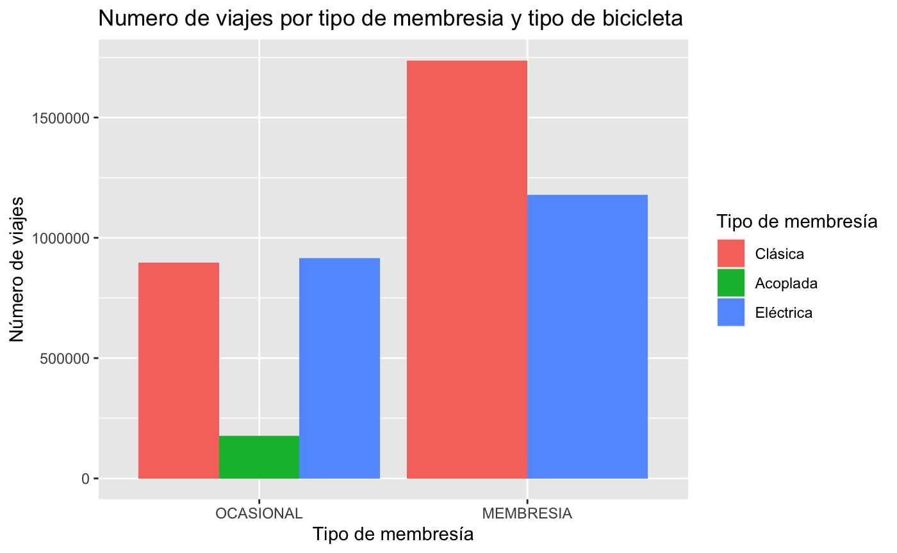

# Caso de estudio Cyclistic - Google Data Analytics
## Autor: Allan Balam Rueda Gutiérrez
## Fecha: 04/03/2023

# Caso práctico: ¿Cómo lograr el éxito rápido de un negocio de bicicletas compartidas?

## Introducción

**Cyclistic** es una compañía de bicicletas compartidas con sede en Chicago que lanzó una exitosa oferta en el 2016. Posee una flota de 5,824 bicicletas georreferenciadas y bloqueadas en una red de 692 estaciones en toda Chicago. Las bicicletas se pueden desbloquear desde una estación y devolverse en cualquier otra estación del sistema en cualquier momento.

Cuenta con tres de planes de precios para sus clientes: plan de un solo viaje, plan para un solo día y una membresía anual. Los analistas financieros afirman que los planes de membresía anual son más rentables en comparación con los otros dos planes ocasionales. La directora de marketing Lily Moreno, piensa que aumentar el número de membresías anuales es clave para el crecimiento de la empresa. Y una gran posibilidad es convertir los ciclistas de un viaje o de un día en ciclistas con membresía anual.

Por lo anterior, se debe entender primero, cómo difieren los miembros anuales y los ciclistas ocasionales. Y a partir de esto, se debe generar una estrategia de marketing para convertir los ciclistas ocasionales en miembros con membresía anual.

## Escenario

Soy un analista de datos junior que trabaja en el equipo de analistas de marketing de Cyclistic. La directora de marketing cree que el éxito futuro de la empresa depende de maximizar la cantidad de membresías anuales. Por lo tanto, mi equipo quiere entender qué diferencias existen en el uso de las bicicletas Cyclistic entre los ciclistas ocasionales y los miembros anuales. A través de estos conocimientos, mi equipo diseñará una nueva estrategia de marketing para convertir a los ciclistas ocasionales en miembros anuales. Sin embargo, antes de eso, los ejecutivos de Cyclistic deben aprobar mis recomendaciones; por eso, voy a respaldar mi propuesta con una visión convincente de los datos y visualizaciones profesionales de los mismos.

## 1. Preguntar

### 1.1 Preguntas

Tres preguntas guiarán el futuro programa de marketing:

1. ¿En qué se diferencian los socios anuales y los ciclistas ocasionales con respecto al uso de las bicicletas de Cyclistic?

2. ¿Por qué los ciclistas ocasionales comprarían membresías anuales de Cyclistic?

3. ¿Cómo puede usar Cyclistic los medios digitales para influenciar a los ciclistas ocasionales a convertirse en miembros?

### 1.2 Tarea empresarial

¿En qué se diferencian los socios anuales y los ciclistas ocasionales con respecto al uso de las bicicletas de Cyclistic?

### 1. 3 Personajes interesados

●   **Lily Moreno:** La directora de marketing y mi gerente. Moreno es responsable del desarrollo de campañas e iniciativas para promover el programa de bicicletas compartidas. Las campañas pueden incluir correo electrónico, redes sociales y otros canales.

●   **Equipo de análisis computacional de datos de marketing de Cyclistic:** Un equipo de analistas de datos que se encargan de recopilar, analizar e informar datos que ayudan a conducir la estrategia de marketing de Cyclistic. 

●   **Equipo ejecutivo de Cyclistic:** El equipo ejecutivo, sumamente detallista, decidirá si aprueba el programa de marketing recomendado.

## 2. Preparar

### 2.1 Ubicación de los datos

Se utilizarán los datos históricos de los viajes de Cyclistic para analizar e identificar tendencias de los últimos 12 meses a partir de marzo del año 2022 hasta febrero del año 2023 s ([Descargar aquí](https://divvy-tripdata.s3.amazonaws.com/index.html)). Los archivos descargados se descomprimen y se ubican en una carpeta diferente llamada csv.

### 2.2 Credibilidad de los datos

Para fines de este caso práctico:

- Cyclistic es una empresa ficticia, por lo tanto, los 12 conjuntos de datos que se utilizarán tienen un nombre diferente.
- Los conjuntos de datos son de propiedad y solo me permitirán responder las preguntas de la empresa. 

### 2.3 Integridad de los datos

Los datos están actualizados al momento de la elaboración de este caso práctico. Los nombres de los archivos tienen una nomenclatura estándar, a excepción del mes de septiembre del 2022, por lo cual, se renombra el archivo para mantener una nomenclatura estándar. 

No hay sesgo en los datos son confiables, originales, integrales, actualizados y son proporcionados por *Motivate International Inc.* bajo esta [licencia](https://www.divvybikes.com/data-license-agreement).

### 2.4 Organización de los datos

Para ver la estructura y organización de los datos se realiza la importación de los archivos CSV (archivos separados por comas) en el lenguaje de programación R, utilizando los siguientes pasos:

1. Instalar lo paquetes necesarios

- `tidyverse` para importar datos
- `libridate` para las funciones de fecha
- `ggplot` para la visualización de datos
- `lubridate` para dar formato a las fechas
- `janitor` para limpieza de datos

```R
install.packages("tidyverse")
install.packages("ggplot2")
install.packages("janitor") 
install.packages("skimr") 
install.packages("dplyr")
install.packages("lubridate")  	
```

2. Cargar los paquetes necesarios para el análisis

```R
library(tidyverse) 
library(ggplot2)
library(janitor) 
library(skimr) 
library(dplyr)
library(lubridate)  
```

```R
Registered S3 methods overwritten by 'dbplyr':
  method         from
  print.tbl_lazy     
  print.tbl_sql      
── Attaching packages ─────────────────────────────────────────────────── tidyverse 1.3.1 ──
✓ ggplot2 3.3.5     ✓ purrr   0.3.4
✓ tibble  3.1.6     ✓ dplyr   1.0.8
✓ tidyr   1.2.0     ✓ stringr 1.4.0
✓ readr   2.1.2     ✓ forcats 0.5.1
── Conflicts ────────────────────────────────────────────────────── tidyverse_conflicts() ──
x dplyr::filter() masks stats::filter()
x dplyr::lag()    masks stats::lag()

Attaching package: ‘janitor’

The following objects are masked from ‘package:stats’:

    chisq.test, fisher.test


Attaching package: ‘lubridate’

The following objects are masked from ‘package:base’:

    date, intersect, setdiff, union
```


3. Importar datos

```R
mes_01 <- read_csv("csv/202202-divvy-tripdata.csv")
mes_02 <- read_csv("csv/202203-divvy-tripdata.csv")
mes_03 <- read_csv("csv/202204-divvy-tripdata.csv")
mes_04 <- read_csv("csv/202205-divvy-tripdata.csv")
mes_05 <- read_csv("csv/202206-divvy-tripdata.csv")
mes_06 <- read_csv("csv/202207-divvy-tripdata.csv")
mes_07 <- read_csv("csv/202208-divvy-tripdata.csv")
mes_08 <- read_csv("csv/202209-divvy-tripdata.csv")
mes_09 <- read_csv("csv/202210-divvy-tripdata.csv")
mes_10 <- read_csv("csv/202211-divvy-tripdata.csv")
mes_11 <- read_csv("csv/202212-divvy-tripdata.csv")
mes_12 <- read_csv("csv/202301-divvy-tripdata.csv")
```

4. Revisar la estructura de los archivos utilizando la función `glimpse()`.

```R
glimpse(mes_01)
glimpse(mes_02)
glimpse(mes_03)
glimpse(mes_04)
glimpse(mes_05)
glimpse(mes_06)
glimpse(mes_07)
glimpse(mes_08)
glimpse(mes_09)
glimpse(mes_10)
glimpse(mes_11)
glimpse(mes_12)
```

Se puede observar cada mes tiene 13 columnas y cada columna tiene el mismo nombre y el mismo tipo de datos en todos los meses.

```R
Columns: 13
$ ride_id            <chr> "E1E065E7ED285C02", "1602DCDC5B30FFE3", "BE7DD2AF4B55C4AF", "A1…
$ rideable_type      <chr> "classic_bike", "classic_bike", "classic_bike", "classic_bike",…
$ started_at         <dttm> 2022-02-19 18:08:41, 2022-02-20 17:41:30, 2022-02-25 18:55:56,…
$ ended_at           <dttm> 2022-02-19 18:23:56, 2022-02-20 17:45:56, 2022-02-25 19:09:34,…
$ start_station_name <chr> "State St & Randolph St", "Halsted St & Wrightwood Ave", "State…
$ start_station_id   <chr> "TA1305000029", "TA1309000061", "TA1305000029", "13235", "TA130…
$ end_station_name   <chr> "Clark St & Lincoln Ave", "Southport Ave & Wrightwood Ave", "Ca…
$ end_station_id     <chr> "13179", "TA1307000113", "13011", "13323", "TA1307000111", "TA1…
$ start_lat          <dbl> 41.88462, 41.92914, 41.88462, 41.94815, 41.88462, 41.89435, 41.…
$ start_lng          <dbl> -87.62783, -87.64908, -87.62783, -87.66394, -87.62783, -87.6228…
$ end_lat            <dbl> 41.91569, 41.92877, 41.87926, 41.95283, 41.88584, 41.88032, 41.…
$ end_lng            <dbl> -87.63460, -87.66391, -87.63990, -87.64999, -87.63550, -87.6351…
$ member_casual      <chr> "member", "member", "member", "member", "member", "member", "me…

```

## 3. Procesar

### 3.1 Limpieza de datos

Para realizar la etapa del proceso de limpieza de datos se utiliza el lenguaje de programacion R y siguiendo los siguientes pasos:

1. Su utiliza la funcion `rbind()` para combinar los 12 meses. Se observa que el conjunto de datos tiene **5754248** observaciones.

```R
trip_data <- rbind(mes_01, mes_02, mes_03, mes_04, mes_05, mes_06, mes_07, mes_08, mes_09, mes_10, mes_11, mes_12)
```

2.  Revisar el nombre de las columnas y verificar que son 13 en total.

```R
colnames(trip_data)
```

```R
 [1] "ride_id"            "rideable_type"      "started_at"         "ended_at"          
 [5] "start_station_name" "start_station_id"   "end_station_name"   "end_station_id"    
 [9] "start_lat"          "start_lng"          "end_lat"            "end_lng"           
[13] "member_casual"   
```

3.  Eliminar las columnas que no son necesarias `start_lat, start_lng, end_lat, end_lng`:

```R
trip_data <- trip_data %>%
  select(-c(start_lat, end_lat, start_lng, end_lng))
```

4. Obtenemos las dimensiones del dataframe

```R
dim(trip_data) 
```

```R
[1] 5754248       9
```

5. Observamos las primeras 6 filas del dataframe

```R
head(trip_data) 
```

6. Revisamos la estructura del dataframe

```R
str(trip_data)
```

```R
tibble [5,754,248 × 9] (S3: tbl_df/tbl/data.frame)
 $ ride_id           : chr [1:5754248] "E1E065E7ED285C02" "1602DCDC5B30FFE3" "BE7DD2AF4B55C4AF" "A1789BDF844412BE" ...
 $ rideable_type     : chr [1:5754248] "classic_bike" "classic_bike" "classic_bike" "classic_bike" ...
 $ started_at        : POSIXct[1:5754248], format: "2022-02-19 18:08:41" "2022-02-20 17:41:30" "2022-02-25 18:55:56" ...
 $ ended_at          : POSIXct[1:5754248], format: "2022-02-19 18:23:56" "2022-02-20 17:45:56" "2022-02-25 19:09:34" ...
 $ start_station_name: chr [1:5754248] "State St & Randolph St" "Halsted St & Wrightwood Ave" "State St & Randolph St" "Southport Ave & Waveland Ave" ...
 $ start_station_id  : chr [1:5754248] "TA1305000029" "TA1309000061" "TA1305000029" "13235" ...
 $ end_station_name  : chr [1:5754248] "Clark St & Lincoln Ave" "Southport Ave & Wrightwood Ave" "Canal St & Adams St" "Broadway & Sheridan Rd" ...
 $ end_station_id    : chr [1:5754248] "13179" "TA1307000113" "13011" "13323" ...
 $ member_casual     : chr [1:5754248] "member" "member" "member" "member" ...
```

7. Obtenemos un primer resumen estadístico de los datos

```R
summary(trip_data) 
```

```R
   ride_id          rideable_type        started_at                 
 Length:5754248     Length:5754248     Min.   :2022-02-01 00:03:18  
 Class :character   Class :character   1st Qu.:2022-06-02 15:18:09  
 Mode  :character   Mode  :character   Median :2022-07-27 22:50:40  
                                       Mean   :2022-07-29 13:28:03  
                                       3rd Qu.:2022-09-22 20:34:47  
                                       Max.   :2023-01-31 23:56:09  
    ended_at                   start_station_name start_station_id   end_station_name  
 Min.   :2022-02-01 00:09:37   Length:5754248     Length:5754248     Length:5754248    
 1st Qu.:2022-06-02 15:37:50   Class :character   Class :character   Class :character  
 Median :2022-07-27 23:09:33   Mode  :character   Mode  :character   Mode  :character  
 Mean   :2022-07-29 13:47:21                                                           
 3rd Qu.:2022-09-22 20:53:25                                                           
 Max.   :2023-02-04 04:27:03                                                           
 end_station_id     member_casual     
 Length:5754248     Length:5754248    
 Class :character   Class :character  
 Mode  :character   Mode  :character  
```

8. Agregar columnas que muestren la fecha, mes, día y año de cada viaje. Esto nos permitirá agregar datos de viaje para cada mes, día o año... antes de completar estas operaciones solo podíamos agregar a nivel de viaje.

```R
trip_data$date <- as.Date(trip_data$started_at) #El formato por default es yyyy-mm-dd
trip_data$month <- format(as.Date(trip_data$date), "%m")
trip_data$day <- format(as.Date(trip_data$date), "%d")
trip_data$year <- format(as.Date(trip_data$date), "%Y")
trip_data$day_of_week <- format(as.Date(trip_data$date), "%A")
```

9. Agregamos una nueva columna que contenga la estación del año

```R
trip_data <- trip_data %>%
  mutate(season = case_when(
    (month == "12") | (month == "01") | (month == "02") ~ "winter",
    (month == "03") | (month == "04") | (month == "05") ~ "spring",
    (month == "06") | (month == "07") | (month == "08") ~ "summer",
    (month == "09") | (month == "10") | (month == "11") ~ "autumn"
  ))
```

10. Agregar una columna llamada `ride_length` que calcula la duración del viaje en segundos

```R
trip_data$ride_length <- difftime(trip_data$ended_at,trip_data$started_at)
```

11. Inspeccionar la nueva estructura con las columnas recién agregadas

```R
str(trip_data)
```

```R
tibble [5,754,248 × 16] (S3: tbl_df/tbl/data.frame)
 $ ride_id           : chr [1:5754248] "E1E065E7ED285C02" "1602DCDC5B30FFE3" "BE7DD2AF4B55C4AF" "A1789BDF844412BE" ...
 $ rideable_type     : chr [1:5754248] "classic_bike" "classic_bike" "classic_bike" "classic_bike" ...
 $ started_at        : POSIXct[1:5754248], format: "2022-02-19 18:08:41" "2022-02-20 17:41:30" "2022-02-25 18:55:56" ...
 $ ended_at          : POSIXct[1:5754248], format: "2022-02-19 18:23:56" "2022-02-20 17:45:56" "2022-02-25 19:09:34" ...
 $ start_station_name: chr [1:5754248] "State St & Randolph St" "Halsted St & Wrightwood Ave" "State St & Randolph St" "Southport Ave & Waveland Ave" ...
 $ start_station_id  : chr [1:5754248] "TA1305000029" "TA1309000061" "TA1305000029" "13235" ...
 $ end_station_name  : chr [1:5754248] "Clark St & Lincoln Ave" "Southport Ave & Wrightwood Ave" "Canal St & Adams St" "Broadway & Sheridan Rd" ...
 $ end_station_id    : chr [1:5754248] "13179" "TA1307000113" "13011" "13323" ...
 $ member_casual     : chr [1:5754248] "member" "member" "member" "member" ...
 $ date              : Date[1:5754248], format: "2022-02-19" "2022-02-20" "2022-02-25" ...
 $ month             : chr [1:5754248] "02" "02" "02" "02" ...
 $ day               : chr [1:5754248] "19" "20" "25" "14" ...
 $ year              : chr [1:5754248] "2022" "2022" "2022" "2022" ...
 $ day_of_week       : chr [1:5754248] "Saturday" "Sunday" "Friday" "Monday" ...
 $ season            : chr [1:5754248] "winter" "winter" "winter" "winter" ...
 $ ride_length       : 'difftime' num [1:5754248] 915 266 818 417 ...
  ..- attr(*, "units")= chr "secs"
```

12. Convertir la columna `ride_length` de Factor a numeric poder hacer cálculos en los datos

```R
is.factor(trip_data$ride_length)
trip_data$ride_length <- as.numeric(as.character(trip_data$ride_length))
is.numeric(trip_data$ride_length)
```

13. Elminar los datos malo. El dataframe incluye algunos cientos de registros cuando las bicicletas se sacaron de los muelles y se verificó que la calidad o el tiempo de viaje fue negativo. Se crea una nueva versión del dataframe (v2) ya que se están eliminando los datos

```R
trip_data_v2 <- trip_data[!(trip_data$start_station_name == "HQ QR" | trip_data$ride_length<0),]
```

14. Eliminar las filas y columnas vacías

```R
trip_data_v2 <- trip_data_v2 %>% 
  remove_empty(which = c("cols", "rows"))
```

15. Verificamos si hay datos NA

```R
colSums(is.na(trip_data_v2))
```

```R
           ride_id      rideable_type         started_at           ended_at 
                 0                  0                  0                  0 
start_station_name   start_station_id   end_station_name     end_station_id 
                 0                  0             473199             473199 
     member_casual               date              month                day 
                 0                  0                  0                  0 
              year        day_of_week             season        ride_length 
                 0                  0                  0                  0 
```

## 4. Análisis de datos

1. Análisis descriptivo en `ride_length` (todas las cifras en segundos)

```R
# Promedio directo (ride length / rides)
mean(trip_data_v2$ride_length) 
# Número de punto medio en la matriz ascendente de longitudes de viaje
median(trip_data_v2$ride_length) 
# El viaje más largo
max(trip_data_v2$ride_length) 
# El viaje más corto
min(trip_data_v2$ride_length) 
```

2. Obtenemos el mismo resultado con la funcion `summary()`

```R
summary(trip_data_v2)
```

```R
   ride_id          rideable_type        started_at                 
 Length:4910646     Length:4910646     Min.   :2022-02-01 00:03:18  
 Class :character   Class :character   1st Qu.:2022-06-03 10:02:49  
 Mode  :character   Mode  :character   Median :2022-07-27 16:26:22  
                                       Mean   :2022-07-29 14:23:08  
                                       3rd Qu.:2022-09-22 09:10:43  
                                       Max.   :2023-01-31 23:53:18  
    ended_at                   start_station_name start_station_id   end_station_name  
 Min.   :2022-02-01 00:09:37   Length:4910646     Length:4910646     Length:4910646    
 1st Qu.:2022-06-03 10:23:56   Class :character   Class :character   Class :character  
 Median :2022-07-27 16:43:07   Mode  :character   Mode  :character   Mode  :character  
 Mean   :2022-07-29 14:43:31                                                           
 3rd Qu.:2022-09-22 09:28:29                                                           
 Max.   :2023-02-04 04:27:03                                                           
 end_station_id     member_casual           date               month          
 Length:4910646     Length:4910646     Min.   :2022-02-01   Length:4910646    
 Class :character   Class :character   1st Qu.:2022-06-03   Class :character  
 Mode  :character   Mode  :character   Median :2022-07-27   Mode  :character  
                                       Mean   :2022-07-28                     
                                       3rd Qu.:2022-09-22                     
                                       Max.   :2023-01-31                     
     day                year           day_of_week           season         
 Length:4910646     Length:4910646     Length:4910646     Length:4910646    
 Class :character   Class :character   Class :character   Class :character  
 Mode  :character   Mode  :character   Mode  :character   Mode  :character  
                                                                            
                                                                            
                                                                            
  ride_length     
 Min.   :      0  
 1st Qu.:    356  
 Median :    626  
 Mean   :   1223  
 3rd Qu.:   1125  
 Max.   :2483235  
```

3. Comparar usuarios miembros con usuarios casuales

```R
aggregate(trip_data_v2$ride_length ~ trip_data_v2$member_casual, FUN = mean)
```

| trip_data_v2$member_casual<chr> | trip_data_v2$ride_length<dbl> |
| :------------------------------ | ----------------------------: |
| casual                          |                     1893.5996 |
| member                          |                      764.6096 |

```R
aggregate(trip_data_v2$ride_length ~ trip_data_v2$member_casual, FUN = median)
```

|                                 |                               |
| :------------------------------ | ----------------------------: |
| trip_data_v2$member_casual<chr> | trip_data_v2$ride_length<dbl> |
| casual                          |                           809 |
| member                          |                           532 |

```R
aggregate(trip_data_v2$ride_length ~ trip_data_v2$member_casual, FUN = max)
```

|                                 |                               |
| :------------------------------ | ----------------------------: |
| trip_data_v2$member_casual<chr> | trip_data_v2$ride_length<dbl> |
| casual                          |                       2483235 |
| member                          |                         93594 |

```R
aggregate(trip_data_v2$ride_length ~ trip_data_v2$member_casual, FUN = min)
```

| trip_data_v2$member_casual<chr> | trip_data_v2$ride_length<dbl> |
| :------------------------------ | ----------------------------: |
| casual                          |                             0 |
| member                          |                             0 |

4. Ver el tiempo promedio de viaje por cada usuario miembro frente a cada usario ocasional

```R
aggregate(trip_data_v2$ride_length ~ trip_data_v2$member_casual + trip_data_v2$day_of_week, FUN = mean)
```

| trip_data_v2$member_casual<chr> | trip_data_v2$day_of_week<chr> | trip_data_v2$ride_length<dbl> |
| :------------------------------ | :---------------------------- | ----------------------------: |
| casual                          | Friday                        |                     1832.0665 |
| member                          | Friday                        |                      753.5736 |
| casual                          | Monday                        |                     1894.8831 |
| member                          | Monday                        |                      738.3708 |
| casual                          | Saturday                      |                     2109.2145 |
| member                          | Saturday                      |                      857.3403 |
| casual                          | Sunday                        |                     2218.9022 |
| member                          | Sunday                        |                      849.1904 |
| casual                          | Thursday                      |                     1656.1877 |
| member                          | Thursday                      |                      738.3703 |
| casual                          | Tuesday                       |                     1676.2554 |
| member                          | Tuesday                       |                      725.5199 |
| casual                          | Wednesday                     |                     1598.6149 |
| member                          | Wednesday                     |                      726.6618 |

5. Notamos que los días de la semana están desordenados, se procede a arreglarlo

```R
trip_data_v2$day_of_week <- ordered(trip_data_v2$day_of_week, levels=c("Sunday", "Monday", "Tuestday", "Wednesday", "Thurstday", "Friday", "Saturday"))
```

6. Anora, analicemos el tiempo de viaje promedio por día para miembros frente a usuarios ocasionales

```R
aggregate(trip_data_v2$ride_length ~ trip_data_v2$member_casual + trip_data_v2$day_of_week, FUN = mean)
```

| trip_data_v2$member_casual<chr> | trip_data_v2$day_of_week<ord> | trip_data_v2$ride_length<dbl> |
| :------------------------------ | ----------------------------: | ----------------------------: |
| casual                          |                        Sunday |                     2218.9022 |
| member                          |                        Sunday |                      849.1904 |
| casual                          |                        Monday |                     1894.8831 |
| member                          |                        Monday |                      738.3708 |
| casual                          |                     Wednesday |                     1598.6149 |
| member                          |                     Wednesday |                      726.6618 |
| casual                          |                        Friday |                     1832.0665 |
| member                          |                        Friday |                      753.5736 |
| casual                          |                      Saturday |                     2109.2145 |
| member                          |                      Saturday |                      857.3403 |

7. Analizamos los datos del número de pasajeros por tipo y día de la semana

```R
trip_data_v2 %>% 
  mutate(weekday = wday(started_at, label = TRUE)) %>%  #Se crea el campo weekday usando wday()
  group_by(member_casual, weekday) %>%  #Se agrupa por member_casual y día de la semana
  summarise(number_of_rides = n(),	#Se calcula el promedio del numero de viajes y la duración 
  average_duration = mean(ride_length)) %>% # Se calcula la duración promedio
  arrange(member_casual, weekday)		
```


| :----------------- | -----------: | -------------------: | --------------------: | ---- |
| member_casual<chr> | weekday<ord> | number_of_rides<int> | average_duration<dbl> |      |
| casual             |          Sun |               337778 |             2218.9022 |      |
| casual             |          Mon |               239351 |             1894.8831 |      |
| casual             |          Tue |               226682 |             1676.2554 |      |
| casual             |          Wed |               234362 |             1598.6149 |      |
| casual             |          Thu |               262779 |             1656.1877 |      |
| casual             |          Fri |               283978 |             1832.0665 |      |
| casual             |          Sat |               408482 |             2109.2145 |      |
| member             |          Sun |               332936 |              849.1904 |      |
| member             |          Mon |               416066 |              738.3708 |      |
| member             |          Tue |               461998 |              725.5199 |      |
| member             |          Wed |               461741 |              726.6618 |      |
| member             |          Thu |               463438 |              738.3703 |      |
| member             |          Fri |               404070 |              753.5736 |      |
| member             |          Sat |               376985 |              857.3403 |      |

## 5. Compartir

1. Obtenemos el número de viajes de usuarios ocasionales frente a usuarios con membresía

```R
  trip_data_v2 %>% 
  group_by(member_casual) %>%
  summarise(member_casual = n()) %>%
  mutate(porcentaje = round(member_casual / sum(member_casual)*100, digits = 2)) %>%
  mutate(membresia = c("OCASIONAL", "MIEMBRO")) %>%
 ggplot(aes(x = "", y = porcentaje, fill = membresia)) +
  geom_col() +
  geom_label(aes(label = paste(porcentaje,"%")),
             position = position_stack(vjust = 0.5),
             show.legend = FALSE) +
  coord_polar("y") +
  labs(x="",
       y="",
       title= "Porcentaje por tipo de membresía", 
       fill ="Tipo de membresía")
```



2. Se visualiza el numero de viajes de los últimos 12 meses por usuarios ocasionales frente a usuarios con membresia

```R
trip_data_v2 %>% 
  group_by(member_casual, month) %>% 
  summarise(number_of_rides = n()) %>%
  mutate(porcentaje = paste(round(number_of_rides / sum(number_of_rides)*100, digits = 2), "%")) %>%
  ggplot(aes(x = month, y = number_of_rides, fill = member_casual)) +
  geom_col(position = "dodge", stat ='identity') +
  scale_y_continuous(labels = function(x) format(x, scientific = FALSE), expand = c(0.1,0)) +
  scale_x_discrete(labels = c("ENE","FEB","MAR","ABR","MAY","JUN","JUL","AGO","SEP","OCT","NOV","DIC")) +
  scale_fill_discrete(labels=c("Ocasional", "Miembro")) +
  labs(x= "Meses", 
       y= "Número de viajes", 
       title= "Viajes de bicicleta de los ultimos doce meses", 
       fill ="Tipo de membresía") +
   geom_text(
    aes(x = month, y = number_of_rides, label = porcentaje),
    position = position_dodge(width = 1),
    vjust = .6, hjust=-0.1, size = 2.0, angle=90, check_overlap = TRUE
  )
```



3. Se visualiza el número de viajes por tipo de usuario (member_casual)

```R
trip_data_v2 %>% 
  mutate(weekday = wday(started_at, label = TRUE)) %>% 
  group_by(member_casual, weekday) %>% 
  summarise(number_of_rides = n()) %>% 
  arrange(member_casual, weekday)  %>% 
  mutate(porcentaje = paste(round(number_of_rides / sum(number_of_rides)*100, digits = 2), "%")) %>%
  ggplot(aes(x = weekday, y = number_of_rides, fill = member_casual)) +
  geom_col(position = "dodge") +
  scale_y_continuous(labels = function(x) format(x, scientific = FALSE), expand = c(0.1,0))+
  scale_x_discrete(labels=c("DOM","LUN","MAR","MIE","JUE","VIE","SAB")) +
  scale_fill_discrete(labels=c("Ocasional", "Miembro")) +
  labs(x= "Días de la semana", 
       y= "Número de viajes", 
       title= "Uso de bicicleta por días de la semana", 
       fill ="Tipo de membresía") +
   geom_text(
    aes(x = weekday, y = number_of_rides, label = porcentaje),
    position = position_dodge(width = 1),
    vjust = .6, hjust=-0.1, size = 2.0, angle=90, check_overlap = TRUE
  )
```



4. Se crea una visualización para la duración promedio por día de la semana

```R
trip_data_v2 %>% 
  mutate(weekday = wday(started_at, label = TRUE)) %>% 
  group_by(member_casual, weekday) %>% 
  summarise(number_of_rides = n(), average_duration = mean(ride_length) /60) %>% 
  arrange(member_casual, weekday)  %>% 
  ggplot(aes(x = weekday, y = average_duration, fill = member_casual)) +
  geom_col(position = "dodge") +
  scale_y_continuous(labels = function(x) format(x, scientific = FALSE))+
  scale_x_discrete(labels=c("DOM","LUN","MAR","MIE","JUE","VIE","SAB")) +
  scale_fill_discrete(labels=c("Ocasional", "Miembro")) +
  labs(x= "Días de la semana", 
       y= "Duración promedio (min)", 
       title= "Uso de bicicleta en minutos por días de la semana", 
       fill ="Tipo de membresía") +
  geom_text(
    aes(x = weekday, y = average_duration, label = paste(round(average_duration,digits=0), "min.")),
    position = position_dodge(width = 1),
    vjust = .6, hjust=1.2, size = 2.0, angle=90, check_overlap = TRUE
  )
```



5. Se crea una visualización para la duración promedio por mes

```R
trip_data_v2 %>% 
  group_by(member_casual, month) %>% 
  summarise(number_of_rides = n(), average_duration = mean(ride_length) /60) %>% 
  arrange(member_casual, month)  %>% 
  ggplot(aes(x = month, y = average_duration, fill = member_casual)) +
  geom_col(position = "dodge") +
  scale_y_continuous(labels = function(x) format(x, scientific = FALSE))+
  scale_x_discrete(labels=c("ENE","FEB","MAR","ABR","MAY","JUN","JUL","AGO","SEP","OCT","NOV","DIC")) +
  scale_fill_discrete(labels=c("Ocasional", "Miembro")) +
  labs(x= "Días de la semana", 
       y= "Duración promedio (min)", 
       title= "Uso de bicicleta en minutos por días de la semana", 
       fill ="Tipo de membresía") +
  geom_text(
    aes(x = month, y = average_duration, label = paste(round(average_duration,digits=0), "min.")),
    position = position_dodge(width = 1),
    vjust = .6, hjust=1.2, size = 2.0, angle=90, check_overlap = TRUE
  )
```



6. Se crea una visualización para la duración promedio por mes

```R
trip_data_v2 %>% 
  group_by(member_casual, month) %>% 
  summarise(number_of_rides = n(), average_duration = mean(ride_length) /60) %>% 
  arrange(member_casual, month)  %>% 
  ggplot(aes(x = month, y = average_duration, group=member_casual, color=member_casual )) +
  geom_line(size=1) +
  geom_point() +
  annotate("text", size=4, x=10, y= 32,
           label="Ocacionales")+
  annotate("text", size=4, x=10, y= 15,
           label="Membresia")+
  guides(color="none")+
  ylab("Duración promedio (min)")+
  xlab("Días de la semana")+
  theme(axis.title=element_text(size=10,face="bold"))+
  labs(
       title= "Uso de bicicleta en minutos por días de la semana", 
       fill ="Tipo de membresía") +
  scale_x_discrete(labels=c("ENE","FEB","MAR","ABR","MAY","JUN","JUL","AGO","SEP","OCT","NOV","DIC")) 
```



7. Uso de la bicicleta por estaciones del año

```R
  trip_data_v2 %>% 
  group_by(member_casual, season) %>% 
  summarise(number_of_rides = n(), average_duration = mean(ride_length) /60) %>% 
  arrange(member_casual, season)%>% 
  ggplot(aes(x = season, y = average_duration, fill = member_casual)) +
  geom_col(position = "dodge") +
  scale_y_continuous(labels = function(x) format(x, scientific = FALSE))+
  scale_x_discrete(labels=c("Otoño","Primavera","Verano","Invierno")) +
  scale_fill_discrete(labels=c("Ocasional", "Miembro")) +
  labs(x= "Estaciones del año", 
       y= "Duración promedio (min)", 
       title= "Uso de bicicleta en minutos por estaciones del año", 
       fill ="Tipo de membresía") +
  geom_text(
    aes(x = season, y = average_duration, label = paste(round(average_duration,digits=0), "min.")),
    position = position_dodge(width = 1),
    vjust = .6, hjust=1.2, size = 2.0, angle=90, check_overlap = TRUE
  )
```



8.  Numero de ciajes por tipo de membresia y tipo de bicicleta

```R
  trip_data_v2 %>% 
  group_by(rideable_type, member_casual) %>% 
  summarise(number_of_rides = n()) %>% 
  arrange(rideable_type, member_casual)%>%
  ggplot(aes(x = member_casual, y = number_of_rides, fill = rideable_type)) +
  geom_col(position = "dodge") +
  scale_y_continuous(labels = function(x) format(x, scientific = FALSE))+
  scale_x_discrete(labels=c("OCASIONAL","MEMBRESIA")) +
  scale_fill_discrete(labels=c("Clásica", "Acoplada", "Eléctrica")) +
  labs(x= "Tipo de membresía", 
       y= "Número de viajes", 
       title= "Numero de viajes por tipo de membresia y tipo de bicicleta", 
       fill ="Tipo de membresía")
```



## 6. Actuar

### 6.1 Conclusiones del análisis 

Los datos muestran que se tienen más viajes realizados por los clientes que tienen membresía anual con un 59.41%  frente a los miembros ocasionales con un 40.59%.

Durante los meses de junio, julio y agosto se realizaron el mayor número de viajes tanto de clientes con membresía como ocasionales. El calor puede ser un factor para que los ciclistas quieran viajar en bicicleta. Esto indica que las épocas del año afectan el número de viajes.

Los datos muestran que el sábado y domingo es cuando los clientes ocasionales realizan la mayor cantidad de viajes a comparación de los clientes con membresía, quienes realizan la mayor cantidad de viajes en los días martes, miércoles y jueves. Esto nos indica que utilizan la bicicleta para ir a sus trabajos.

Algo importante que se destaca es que a pesar de que los clientes con membresía realicen más cantidad de viajes, los clientes ocasionales utilizan más minutos para sus viajes, principalmente el sábado y domingo, con un promedio al rededor de 35 min, frente los 14 minutos de los clientes con membresía. Esto ratifica lo expuesto anteriormente, es decir, los clientes con membresía utilizan la bicicleta para ir al trabajo y los usuarios ocasionales utilizan parte de su tiempo libre el fin de semana para realizar sus viajes.

El número de minutos que utilizan los clientes, tanto ocasionales como lo que tienen una membresía, es un patrón que se repite durante todos los meses del año, siendo marzo el mes con más minutos utilizados por los miembros ocasionales. Nuevamente, ratifica el hecho de que los clientes ocasionales pasan más tiempo en sus viajes en bicicleta que los clientes con membresía, quienes utilizan la bicicleta para ir a sus trabajos. 

Los datos muestran que en la temporada invernal los clientes con membresía viajan el menor tiempo con un promedio de 11 min. Mientras que los clientes ocasionales tienen una duración en sus viajes de 26 minutos, lo que indica que los usuarios ocasionales viajan más minutos a pesar de la temporada invernal. Esto puede ser un factor de costos que se debe investigar para concluir si el costo es un factor determinante para obtener una membresía anual.

Finalmente, se puede observar con membresía prefieren utilizar más las bicicletas clásicas que las eléctricas para tener más libertad de movilidad debido a sus trabajos. Por otro lado, los clientes ocasionales prefieren las bicicletas eléctricas seguidas de las clásicas y muy pocas las acopladas. Esto puede indicar que muchos de los clientes ocasionales pueden ser visitantes.

### 6.2 Recomendaciones

Para convertir a miembros anuales los clientes ocasionales, se puede ofrecer un descuento en su primer año de suscripción, debido a la cantidad de minutos que pasan estos clientes en cada viaje. Esto puede ser un beneficio atractivo para animarlos a comprar su membresía anual.

Ofrecer un programa de beneficios una vez que obtienes una membresía anual, por ejemplo, uno de los beneficios puede ser, realizar descuentos después de un cierto número de viajes o tiempo recorrido, o si recomiendas a un amigo o familiar que obtenga una membresía anual pueden obtener descuentos.

La campaña de marketing debe realizarse los días sábado y domingo, principalmente durante la primavera y el verano, ya que estos meses son los que tienen mayor cantidad de viajes de usuarios ocasionales.

Durante la campaña de marketing, se puede informar a los clientes ocasionales que el uso de la bicicleta, principalmente la clásica, tiene muchos beneficios para la salud, de esta manera se da un incentivo para que obtengan una membresía anual. 

